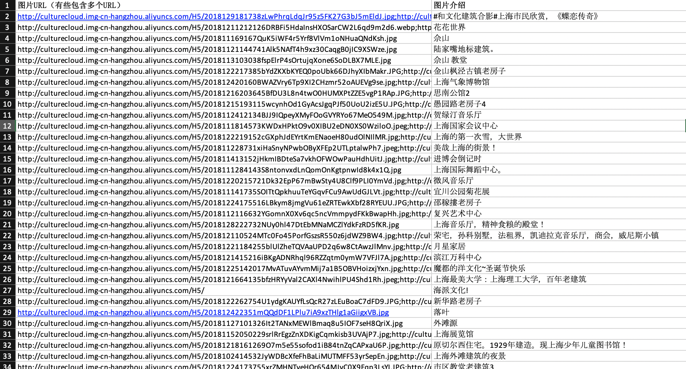
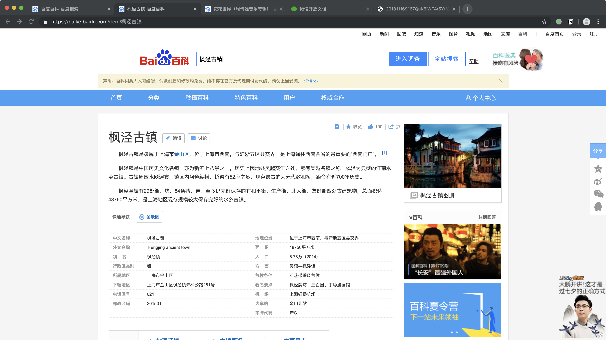
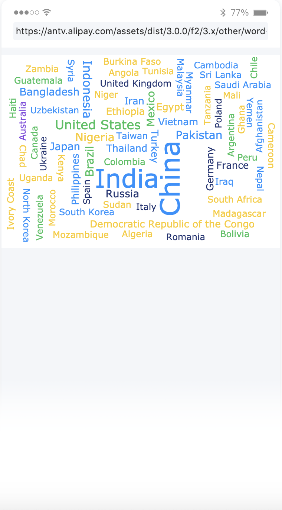

# 黑客的画笔
## 概述
这是个小程序主要利用了一些上海经典建筑图片，目的在于通过这些图片把**历史上一些优秀的画作**和**一些经典的计算机算法**联系起来。 
主要面向与非计算机和非艺术专业的人，给他们提供了解艺术和计算机魅力的机会。 
## 页面介绍
现在主要有六个界面，下面对它们依次作简单的介绍。 
### 主页
主页是程序的入口，展示选择的图片（上海经典建筑图片）、选择的取样方法（计算机算法）、选择的笔触（对应艺术风格）。点击对应的按钮，可以进入对应选择页对它们进行选择。 
 
### 选择页
每一个选择页面主要由两个部分构成。一个是页面上部的标签区域，主要用来对数据进行筛选。另一个是页面下部的数据展示区域，用于展示包含所选标签的所有数据。可以点击每一条数据进入该数据的详情介绍页面。 
 
### 详情页
该页面可以对选择的数据进行详情展示，并且可以标记为已经读完或者学完。(这个功能还没有添加） 
 

### 绘图页
绘图页是该小程序最核心的页面，因为在这个页面将动态的展现艺术和计算机的魅力。这个页面首先会加载选择的建筑图片，当图片加载完成后，可以点击绘制按钮进行图片的绘制。 
 
在绘制的过程首先会用选定的计算机算法对原图的点进行取样，然后以选定的风格绘制在画布上。当绘制完成后，可以选择对新的图片进行保存或者放弃。如果选择放弃，那么就返回主页，否者会将新生成的图片保存到画廊页面。 
 
### 画廊页
在该页面会展示当前用户所绘制的图片，可以对这些图片进行删除和分享。可以点击图片查看大图，也可以点击图片上的标签，跳转到对应介绍算法、艺术风格和建筑的详情。（这个功能还没有添加） 
 
### 个人页
该页面会展示用户的头像和昵称，并且对用户的行为进行一些基本的可视化。比如每天读详情页对数量，完成阅读的详情页面所占百分比。 
 
## 还要做的事
目前主要完成该小程序的最基础的业务逻辑，还要以下的事需要在8月11号之前做完。 

- 完善数据：建筑数据、艺术风格的数据、计算机算法的数据。
- 可视化：学会在微信小程序中使用AntV，掌握标签云、条形图、折线图、饼图的使用。
- 界面：学会使用lin-ui，看一些比较好的界面风格，为后面界面的第二次迭代做准备。
- 详情页：学会使用在微信小程序中写markdown。
## 分工
### 雷
处理建筑数据，这份数据是data文件夹里面的1.xlsx。是一些图片数据，需要给每一个图片提取出关键字或者地名，并且对它们打标签。 
 
这写图片可以之间url复制到浏览器查看，但是注意不要在末尾加“;”。 
 
每一张图片的关键字只有一个，但是标签可以有很多个。同时每一张的图片的标签至少有一个，就是它的关键字。 
关键字的要求是能被输入百度百科有结果，后续会从根据关键字从百度百科上爬取数据。 
 
标签的要求是能对图片的特征进行概括。 
- 时间：白天，黑夜。
- 季节：春，夏，秋，冬。
- 建筑风格：现代建筑、寺庙等。

标签的分类标准需要你自己来确定，上面是举个例子。每一张图片的标签不宜太多，总的标签数也不宜太多，初步定在100个左右。标签的作用是让用户快速筛选数据，并且这些标签将会以标签云的方式展示。 
 

最后完成后的表格的格式如下图。 
 

### 苏
完善功能和界面
## 资源
- 当前版本二维码：体验者用微信扫码即可以使用 
 

- 数据：进入data文件，下载1.xlsx（数据）或者1.pdf（数据的介绍）。 

