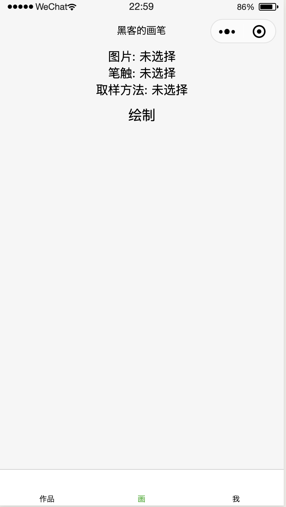
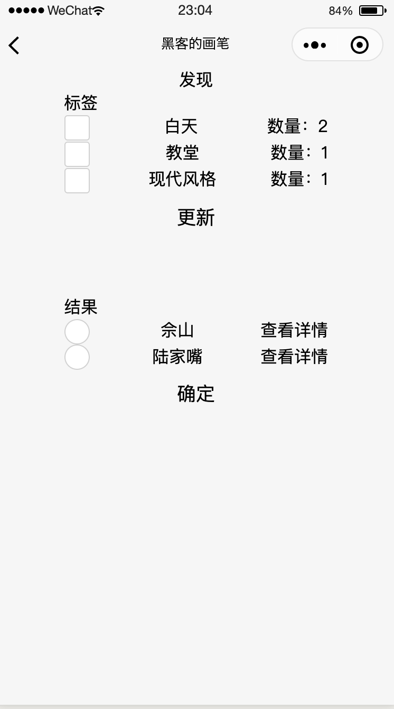
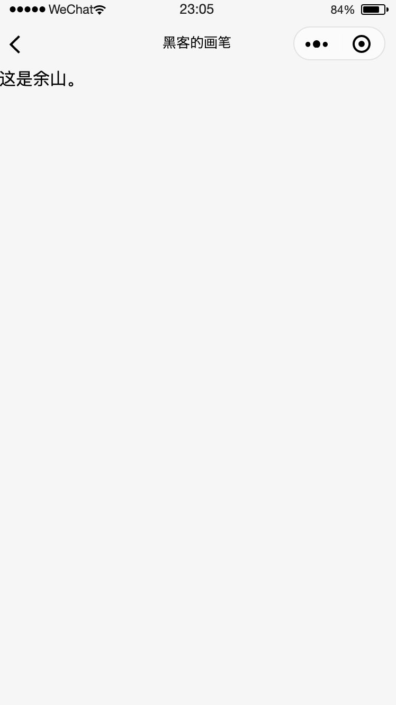
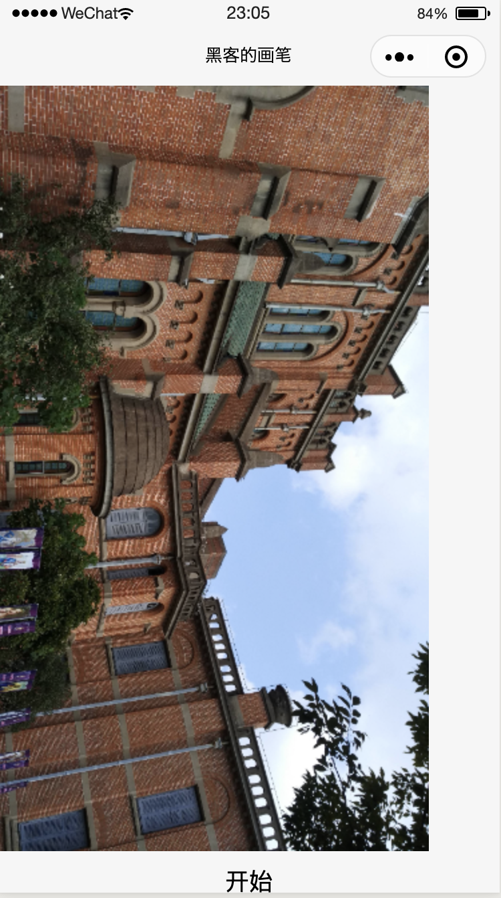
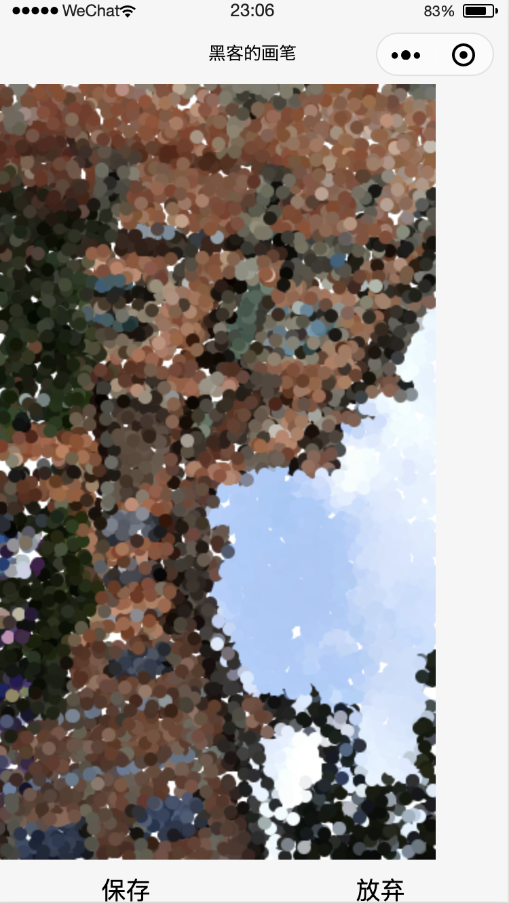
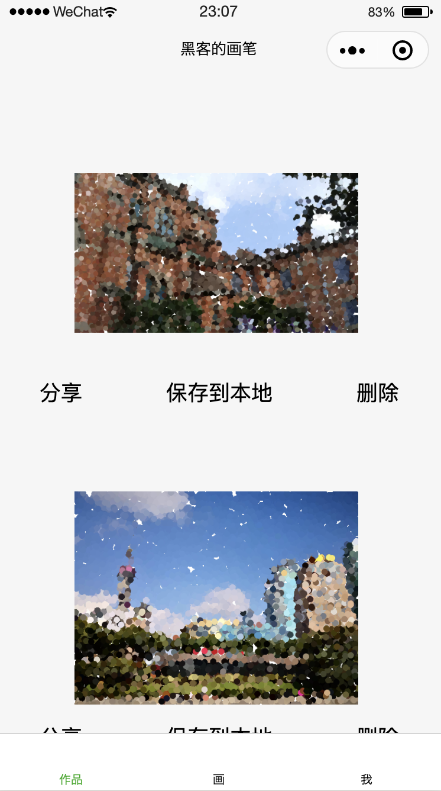
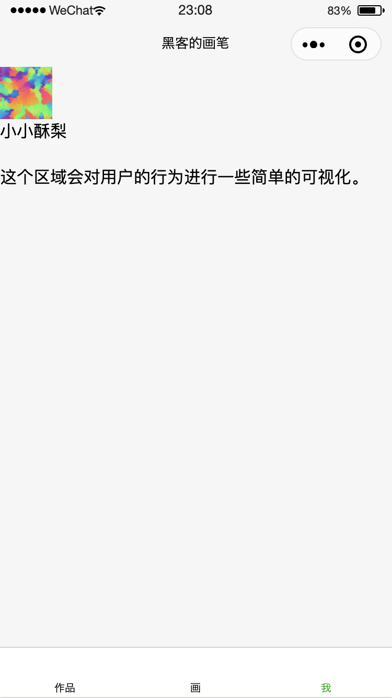

# 黑客的画笔
## 概述
这是个小程序主要利用了一些上海经典建筑图片，目的在于通过这些图片把**历史上一些优秀的画作**和**一些经典的计算机算法**联系起来。
主要面向与非计算机和非艺术专业的人，给他们提供了解艺术和计算机魅力的机会。
## 页面介绍
现在主要有六个界面，下面对它们依次作简单的介绍。
### 主页

### 选择页

### 详情页

### 绘图页

### 画廊页

### 个人页

## 还要做的事
目前主要完成该小程序的最基础的业务逻辑，还要以下的事需要在8月12号之前做完。
- 完善数据
- 可视化
- 界面
- 详情页

## 分工
## 资源
- 当前版本二维码：用微信扫码即可以使用
- 数据
 - 数据介绍pdf
 - 数据

